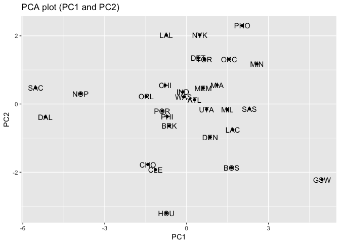

Hw03-Matt-Brennan
================
Matt Brennan
10/15/2017

Ranking the teams by salary

``` r
library(dplyr)
```

    ## Warning: package 'dplyr' was built under R version 3.4.2

    ## 
    ## Attaching package: 'dplyr'

    ## The following objects are masked from 'package:stats':
    ## 
    ##     filter, lag

    ## The following objects are masked from 'package:base':
    ## 
    ##     intersect, setdiff, setequal, union

``` r
library(ggplot2)
```

Getting all the data to have teams be usable:

``` r
#missed_fg
#loading the data for the project
github <- "https://github.com/ucb-stat133/stat133-fall-2017/raw/master/"
csv <- "data/nba2017-roster.csv"
download.file(url = paste0(github, csv), destfile = 'nba2017-roster.csv')
dat_roster <- read.csv('nba2017-roster.csv', stringsAsFactors = FALSE)

github <- "https://github.com/ucb-stat133/stat133-fall-2017/raw/master/"
csv <- "data/nba2017-stats.csv"
download.file(url = paste0(github, csv), destfile = 'nba2017-stats.csv')
dat_stats <- read.csv('nba2017-stats.csv', stringsAsFactors = FALSE)

setwd("/Users/matthewbrennan/stat133/stat133-hws-fall17/hw03/data")
dat_stats <- 
  dat_stats %>%
  mutate(missed_fg = dat_stats$field_goals_atts - dat_stats$field_goals_made)

#missed_ft
dat_stats <-
  dat_stats %>%
  mutate(missed_ft = dat_stats$points1_atts - dat_stats$points1_made)

#points
dat_stats <-
  dat_stats %>%
  mutate(points = dat_stats$points1_made + (dat_stats$points2_made*2) +(dat_stats$points3_made*3))

#rebounds
dat_stats <-
  dat_stats %>%
  mutate(rebounds = dat_stats$off_rebounds + dat_stats$def_rebounds)

#efficiency
dat_stats <-
  dat_stats %>%
  mutate(efficiency = (dat_stats$points + dat_stats$rebounds + dat_stats$assists +
         dat_stats$steals + dat_stats$blocks - dat_stats$missed_fg - dat_stats$missed_ft - dat_stats$turnovers)/
         dat_stats$games_played)

setwd("/Users/matthewbrennan/stat133/stat133-hws-fall17/hw03/output")
#creating efficiency_summary.txt
sink(file = "efficiency-summary.txt")
summary(dat_stats$efficiency)
```

    ##    Min. 1st Qu.  Median    Mean 3rd Qu.    Max. 
    ##  -0.600   5.452   9.090  10.137  13.247  33.840

``` r
sink()

setwd("/Users/matthewbrennan/stat133/stat133-hws-fall17/hw03/code")

#merging tables
full_merge = dat_roster %>%
  full_join(dat_stats)
```

    ## Joining, by = "player"

``` r
#creating nba2017_teams.csv
teams <- full_merge %>%
  group_by(team) %>%
  summarise(experience = sum(round(experience,2)), salary = sum(round(salary/1000000,2)), points3 = sum(points3_made),
            points2 = sum(points2_made), free_throws = sum(points1_made), points = sum(points),
            off_rebounds = sum(off_rebounds), def_rebounds = sum(def_rebounds), assists = sum(assists),
            steals = sum(steals), blocks = sum(blocks), turnovers = sum(turnovers), fouls = sum(fouls),
            effieciency = sum(efficiency))
```

``` r
ggplot(teams, aes(reorder(team, salary), salary)) + geom_bar(stat = 'identity', fill = "gray") +geom_hline(yintercept=mean(teams$salary), color = 'orange', size = 4, alpha = .7) +coord_flip() + labs(x = "Team", y = "Salary(in millions)", title = "NBA Teams ranked by Total Salary")
```


``` r
ggplot(teams, aes(reorder(team, salary), salary)) + geom_bar(stat = 'identity', fill = "gray")+geom_hline(yintercept=mean(teams$salary), color = 'orange', size = 4, alpha = .7) +coord_flip() + labs(x = "Team", y = "Total Points", title = "NBA Teams ranked by Total Points")
```

 \#barplot with effieciency

``` r
ggplot(teams, aes(reorder(team, experience), experience)) + geom_bar(stat = 'identity', fill = "gray")+geom_hline(yintercept=mean(teams$experience), color = 'orange', size = 4, alpha = .7) +coord_flip() + labs(x = "Team", y = "Efficiency", title = "NBA Teams ranked by Efficiency")
```


PCA analysis
============

``` r
pc1 <- teams %>%
  select(c(points3, points2, free_throws, off_rebounds, def_rebounds, assists, steals, blocks, turnovers, fouls))

pca <- prcomp(pc1, scale. = TRUE)
ev <- pca$sdev^2
prop <- ev/(sum(ev))
cumprop <- cumsum(prop)
pca_df <- data.frame(ev,prop,cumprop)
pc1 <- pca$x[,1]
pc2 <-pca$x[,2]
teams <- teams %>%
  mutate(PC1 = pc1, PC2 = pc2)
pca_df
```

    ##            ev        prop   cumprop
    ## 1  4.69588631 0.469588631 0.4695886
    ## 2  1.70201009 0.170201009 0.6397896
    ## 3  0.97952464 0.097952464 0.7377421
    ## 4  0.77171938 0.077171938 0.8149140
    ## 5  0.53408824 0.053408824 0.8683229
    ## 6  0.47801622 0.047801622 0.9161245
    ## 7  0.38220374 0.038220374 0.9543449
    ## 8  0.26026243 0.026026243 0.9803711
    ## 9  0.13359274 0.013359274 0.9937304
    ## 10 0.06269622 0.006269622 1.0000000

scatterplot of first two pcs
============================

``` r
ggplot(data=teams, aes(x=PC1, y=PC2)) + geom_point() + labs(title = "PCA plot (PC1 and PC2)",x = "PC1", y = "PC2")+ geom_text(aes(label = teams$team))
```

 Insert based on PC1

``` r
s1 <- 100 * ((pc1 - min(pc1))/(max(pc1) - min(pc1)))
teams <- teams %>%
  mutate(S1 = s1)
```

Barchart of rescaled PC1

``` r
ggplot(teams, aes(reorder(team, S1), S1)) + geom_bar(stat = 'identity', fill = "gray")+geom_hline(yintercept=mean(teams$S1), color = 'orange', size = 4, alpha = .7) +coord_flip() + labs(x = "Team", y = "First PC(scaled from 0 to 100)", title = "NBA Teams ranked by PC1")
```

 The PC1 Index to rank the teams is scaled from 0 to 100 for simplicity of the x-axis of the graph and provides a description of the teams ability by virtue of various statistics. Although this PC1 does not encompass all of the statistics it does cover many significant ones and allows for a unique comparison between teams by virtue of the total amounts for each team.

Comment & Reflection: 1) Not my first time using this project structure. 2) This was not my first time using relative paths. 3) This was not my first time using an R script. 4) Everything related to PC was very hard. 5) The ggplot area was easy. 6) No one helped me to complete this assignment. 7) This homework took 5 hours. 8) The PCA part. 9) The whole project was interesting.
