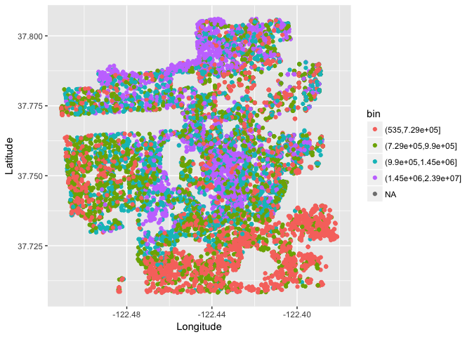
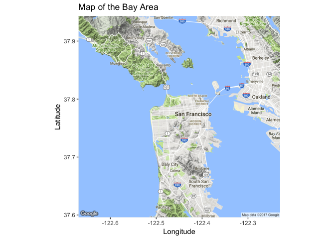
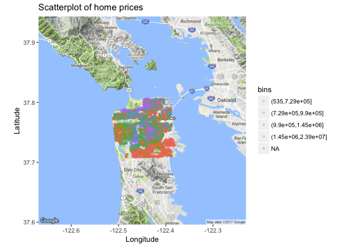
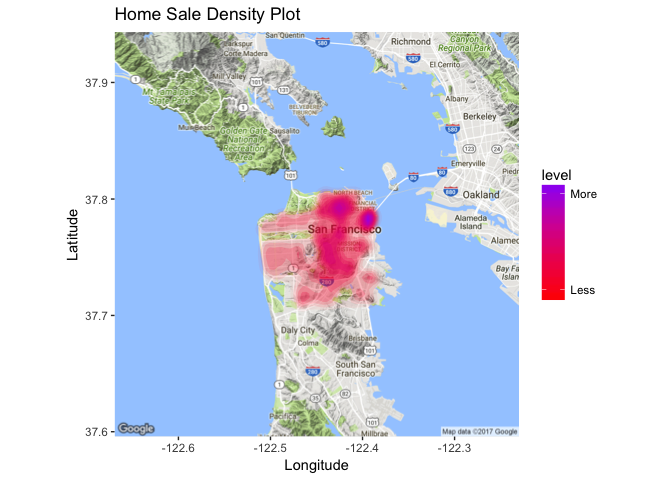

Post2
================
Matt Brennan
11/29/2017

Topic Title: GGmap to Plot Housing Prices in the Expensive Bay Area

The Aim: Through this post I hope to enlighten the reader about the very accessible 'ggmap' library, which can be utilized as a means to produce data visualization for geographic regions. The 'ggmap' library allows for very easy calls to geographic data such as the Google Maps API, which allows for the study of street names, landmarks, elevation, and various other geographic features. Further, one would largely desire to utilize this library when one is dealing with data that pertains to respective areas as a means to associate that data with the characteristics of the geographical data. Although this study focuses upon the cost of living scenario in the Bay Area, as this is a very applicable topic for Berkeley students, the 'ggmap' library could become very useful in the future study of political voting data, crime rates, and virtually any type of polling.

How to use ‘ggmap’: The initial component of ‘ggmap’ relies on a call to 'get\_map()' which makes a call to the Google Maps API, which then allows for various capabilities, but predominantly the zoom feature. One can then call 'ggmap()' on the object to visualize the region in question.

#### Data Collection

In order to practice working with 'ggmap' it is necessary to gather the data first! For this post, we will be analyzing the housing prices of the Bay Area in order to draw relevant conclusions about the area we live in. Through an analysis of the Bay Area, you will be able to see the discrepancies in the housing prices for various areas of the Bay and hopefully even get a realistic assessment about where one could live out of college with a specific income in mind.

The dataset that I will be working with is from Zillow and I selected it because of the various amount of information that related to the locational attributes of the homes that were purchased. Many sites depicted only the street address of the home that was purchased for a sense of location, yet this would fail to allow me to track the location of the home on 'ggmap' as this is insufficient information based on longitude and latitude traits. Furthermore, this file will be downloaded by virtue of 'download.file()' which enables us to incorporate the data into an R-markdown for further manipulation of the data.

``` r
download.file("https://raw.githubusercontent.com/RuiChang123/Regression_for_house_price_estimation/master/final_data.csv",
              destfile="housing-data.csv")

homeData <- data.frame(read.csv('housing-data.csv'))
```

At this point I encourage you to thoroughly examine the data and to highlight some of the nuances of the dataframe. For example, as previously mentioned, the success of this 'ggmap' usage relies on the existence of the longitude and latitude for study of the homes location. Further, there are over 11,000 homes that are identified in this study, which highlights the precision that can be accrued from a thorough search of Bay Area housing.

``` r
# check how many rows there are
nrow(homeData)
```

    ## [1] 11330

``` r
# check how many columns there are
ncol(homeData)
```

    ## [1] 19

Although 19 columns provides a substantial amount of information, we really only need to focus our search upon the relationship between price and the location. For this to be done, we must create a smaller dataframe that reduces the data amount significantly.

``` r
# reduce the data to include only key columns
homePricevsLoc <- homeData[, c("longitude", "latitude", "lastsoldprice")]
```

Upon examination of this newly created dataframe it becomes apparent that the data now can be studied easily to determine more of a correlation rather than accounting for various other factors.

### ggplot as a means to identify trends

Although the 'ggmap' option will be utilized later, it is very important to just simply gather an understanding about the trends in the data. With this being said, we will need to import 'ggplot2' in order for us to plot the differences in the data.

``` r
library(ggplot2)
library(dplyr)
```

    ## Warning: package 'dplyr' was built under R version 3.4.2

    ## 
    ## Attaching package: 'dplyr'

    ## The following objects are masked from 'package:stats':
    ## 
    ##     filter, lag

    ## The following objects are masked from 'package:base':
    ## 
    ##     intersect, setdiff, setequal, union

In order to provide a ranking system for the housing we are gonna place them into four different bins that depict its value. The houses that receive a ranking of (535,7.29e+05\] implies that they are in the bottom 25% in relative price as opposed to those that receive a ranking of (1.45e+06,2.39e+07\] are in the top 25% of housing prices as these ranges depict the dollar sign amounts. This will allow us to have a basic ranking system in order to gauge the price values associated with the data. We use the 'cut' feature as demonstrated below in order to create these bins and then further to make a new dataframe that reflects our work.

``` r
# cut the price vector into bins based on quantile
bins <- cut(homePricevsLoc$lastsoldprice, quantile(homePricevsLoc$lastsoldprice))

# create a new data frame with `bins` as a column
homePriceWithBins <- data.frame(homePricevsLoc, "bin" = bins)
```

Now, we are able to create a plot that reflects the relationship between price and location as done below. The graph is color-coded based on price in order to make the visual easier. At this point we should be able to identify some type of relationship between the location and the price!

``` r
# use ggplot to create a scatterplot that reflects the prices in different colors
ggplot(data=homePriceWithBins) + geom_point(aes(x=longitude, y=latitude, color=bin)) +
  xlab("Longitude") + ylab("Latitude")
```

 I now want to save this visual as a reference in a file called 'homePricesWithBins.txt' so that we have this as a reference in our files. In order to accomplish this task I am going to use sink(), a useful way to save a file.

``` r
getwd()
```

    ## [1] "/Users/matthewbrennan/stat133/stat133-hws-fall17/post2/code"

``` r
sink("/Users/matthewbrennan/stat133/stat133-hws-fall17/post2/images/homePricesWithBins.txt")
ggplot(data=homePriceWithBins) + geom_point(aes(x=longitude, y=latitude, color=bin)) +
  xlab("Longitude") + ylab("Latitude")
```



``` r
sink()
```

Based on the data, we observe that the purple data reflects the more expensive homes while the red data demonstrates cheaper homes. In addition, the data also allows us to observe which data seems to have more of an impact on the price, latitude or longitude? We see that there is a plethora of purple towards the top of the plot and less toward the bottom and vice versa with red.

### Incorporating ggmap

As with any library that one hopes to utilize, we must initially import the library to have access to its features. The install.packages command is needed when one is installing a library for the first time.

``` r
library("ggmap")
```

We now want to figure out the latitude and longitude of San Francisco so that we can input these values into our 'ggmap'. Therefore, upon a search to Google we easily discover that the latitude would be 37.77 degrees and the longitude would be -122.45 degrees. With this information we can create a vector of the city and apply this information to a map.

``` r
sf = c(longitude = -122.45, latitude = 37.77)

# get_map() makes the call to the Google API
bayMap <- get_map(location = sf, zoom = 11, color = "color")
```

    ## Map from URL : http://maps.googleapis.com/maps/api/staticmap?center=37.77,-122.45&zoom=11&size=640x640&scale=2&maptype=terrain&language=en-EN&sensor=false

Our map stored as bayMap now reflects a visual of the Bay Area. The result of a call to get\_map creates the url for the map zoomed in perfectly. For extra practice you could copy and paste the given url into Google and see the location of the area we are studying. If one now utilizes ‘ggmap’ on this bayMap, we are able to see directly on our markdown a visual of the displayed area.

``` r
# establish an original map of the Bay Area prior to changing the display
bayMap1 <- ggmap(bayMap) + xlab("Longitude") + ylab("Latitude")

bayMap1 + ggtitle("Map of the Bay Area")
```

 I now want to save this visual as a reference in a file called 'BayMap1.txt' so that we have this as a reference in our files. In order to accomplish this task I am going to use sink(), a useful way to save a file.

``` r
sink("/Users/matthewbrennan/stat133/stat133-hws-fall17/post2/images/BayMap1.txt")
bayMap1 + ggtitle("Map of the Bay Area")
```


``` r
sink()
```

### Combine the map with the data

As I did prior in this blog, I am going to recreate the areas housing scatterplot but so that we can observe it on the map rather than on just a scatterplot. This will allow us to visualize the housing data better and see how the price of the homes are related to longitude and latitude. In order to do this, I am going to use geom\_point, a part of 'ggplot2', in order to combine the two elements.

``` r
# use ggmap and geom_point to combine the map and the scatterplot
bayMap1 + geom_point(data = homePriceWithBins, aes(x=longitude, y=latitude, color=bins),
                      alpha=.25, cex=1) +
  ggtitle("Scatterplot of home prices")
```

 I now want to save this visual as a reference in a file called 'BayMapWithBins.txt' so that we have this as a reference in our files. In order to accomplish this task I am going to use sink(), a useful way to save a file.

``` r
sink("/Users/matthewbrennan/stat133/stat133-hws-fall17/post2/images/BayMapWithBins.txt")
bayMap1 + geom_point(data = homePriceWithBins, aes(x=longitude, y=latitude, color=bins),
                      alpha=.25, cex=1) +
  ggtitle("Scatterplot of home prices")
```



``` r
sink()
```

This visual now provides an easy demonstration of the areas that possess more higher price homes as opposed to those that are in poorer overall areas. With this being said we are able to identify that a larger latitude number predominantly supports a denser area of high priced homes. Continuing off of the progress we made, we can incorporate a density plot in order to determine the areas that possess more sold houses overall. Thus, to accomplish this task, we must take advantage of 'stat\_density2d'. Just as before I will put the areas that are most dense in purple, and those that are least dense in red in order to keep the comparison maps of similar colors.

``` r
# use ggmap and stat_density2s to combine the map and the scatterplot of density
bayMap1 + 
  stat_density2d(data = homePricevsLoc,
                 aes(x = longitude, y = latitude, fill = ..level.., alpha = ..level..), 
                 size = .0001, bins = 16, geom = "polygon") + 
  scale_fill_gradient(low = "red", high = "purple", labels=c("Less", "More"), breaks=c(40, 285)) + 
  scale_alpha(range = c(0.05, 0.75), guide = FALSE) + 
  ggtitle("Home Sale Density Plot")
```

 I now want to save this visual as a reference in a file called 'BayMapDensity.txt' so that we have this as a reference in our files. In order to accomplish this task I am going to use sink(), a useful way to save a file.

``` r
sink("/Users/matthewbrennan/stat133/stat133-hws-fall17/post2/images/BayMapDensity.txt")
bayMap1 + 
  stat_density2d(data = homePricevsLoc,
                 aes(x = longitude, y = latitude, fill = ..level.., alpha = ..level..), 
                 size = .0001, bins = 16, geom = "polygon") + 
  scale_fill_gradient(low = "red", high = "purple", labels=c("Less", "More"), breaks=c(40, 285)) + 
  scale_alpha(range = c(0.05, 0.75), guide = FALSE) + 
  ggtitle("Home Sale Density Plot")
```



``` r
sink()
```

### Conclusion

We can evidently see through this blog that there are numerous visual and spatial advantages to adapting ‘ggmap’ into one's everyday uses of R. We are able to take locational data and apply this data into a visual image that provides a significant amount more detail than that of a basic scatterplot or other basic statistical features. I hope that through this lab you have acquired a prolific understanding of the basics of this library and proceeding forward you feel confident in your 'ggmap' objectives!

### References:

<https://cran.r-project.org/web/packages/sqldf/index.html>

<https://www.youtube.com/watch?v=9JRsHxKCvsg>

<https://nishanthu.github.io/articles/SQLSetandJoin.html>

<https://www.r-bloggers.com/manipulating-data-frames-using-sqldf-a-brief-overview/>

<http://analyticsplaybook.org/api/learn_sql_30_minutes.html>

<https://www.r-bloggers.com/make-r-speak-sql-with-sqldf/>

<http://blog.yhat.com/posts/10-R-packages-I-wish-I-knew-about-earlier.html>
